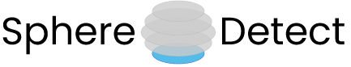

&emsp;

# SphereDetect
High-content experiments imaging spheroids often generate excess image data. Such experiments would benefit from systematic and targeted data acquisition. It can be challenging to systematically find the position where to start imaging, a position that may vary when basing the detection method on fluorophore intensity and perturbations that affect that intensity. There are several methods to perform on-the-fly detection but most are proprietary and microscope-specific. 

Here we present SphereDetect[1](#Ref2025), an algorithm that automatically identifies the first spheroid section in a Z-stack by detecting when the spheroid comes into focus as imaging begins along the Z-axis. It works by finding the maximum change in FocusScore [2](#RefFocusScore1),[3](#RefFocusScore2), taking this point as the starting point. 

### Summary
In the paper, we implemented SphereDetect inside a NIKON Job, detecting spheroids in a 384-well plate during acquisition [1](#Ref2025). In this repo, we also provide solutions that work with a dataset that has already been acquired, either taking the folder with images or a CellProfiler [4](#RefCP) pipeline result as output. We will also provide the link to the original Nikon JOBS, for those who have access to such a system. 
 
We have not extensively tested the algorithm across systems, but we expect that the method works best for images acquired by confocal microscopy. Any constructive feedback is appreciated! 

Notes: 
* We have been using the SYTO14 Cell Painting channel, but any bright channel could work.
* We have worked with cleared spheroids.

References: 

<a name="Ref2025">1</a>: C. Ringers, D. Holmberg, *et al* (2025) High-content morphological profiling by Cell Painting in 3D spheroids. *BioRxiv*

<a name="RefFocusScore1">2</a>: [FocusScore](https://cellprofiler-manual.s3.amazonaws.com/CellProfiler-4.0.5/modules/measurement.html#:~:text=Measurements%20made%20by%20this%20module,-Blur%20metrics&text=FocusScore%3A%20A%20measure%20of%20the,scores%20correspond%20to%20lower%20bluriness)

<a name="RefFocusScore2">3</a>: Sun, Y., Duthaler, S. and Nelson, B.J. (2004), Autofocusing in computer microscopy: Selecting the optimal focus algorithm. Microsc. Res. Tech., 65: 139-149. [doi](https://doi.org/10.1002/jemt.20118)

<a name="RefCP">4</a>: Stirling DR, *et al* (2021). CellProfiler 4: improvements in speed, utility and usability. BMC Bioinformatics, 22 (1), 433. PMID: 34507520 PMCID: PMC8431850  [doi](https://doi.org/10.1186/s12859-021-04344-9)

